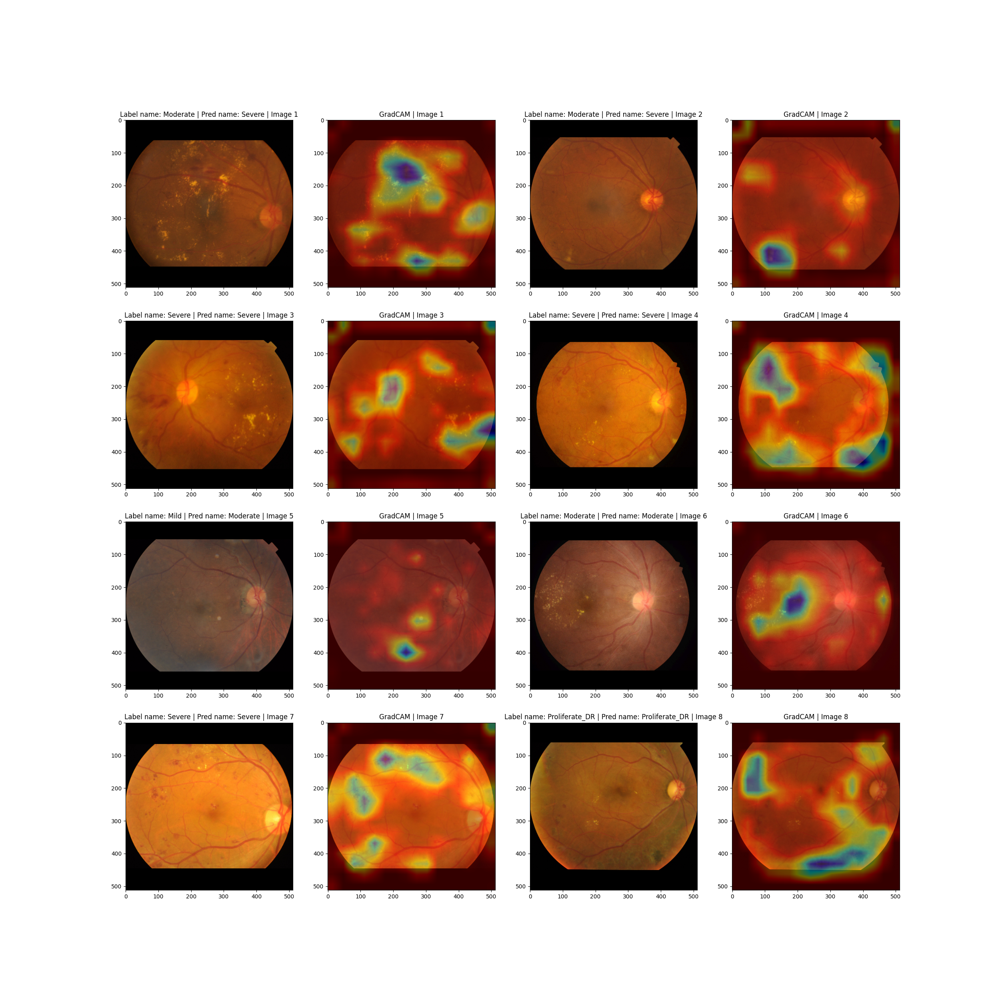

This project was tested on Ubuntu 22.04 LTS with Python 3.10

### How to run the program:
1. Install python 3.10
2) Install everything you need
   - `python -m venv venv`
   - Activate the virtual environment
     - Linux/MacOS: `source venv/bin/activate`
     - Windows: `venv\Scripts\activate`
   - `pip install -r requirements.txt`
   - To setup the GPU version of pytorch, follow the instructions in this [link](https://github.com/openai/whisper/discussions/47).
     A quick summary of the steps is given below:
       - `pip3 install torch torchvision torchaudio --index-url https://download.pytorch.org/whl/cu118 --no-cache-dir --force-reinstall`
         - There should be a download size of 2.3GB if it is downloading the GPU version correctly. If it's something like 600MB, that's the CPU version.
         - If that didn't work, simply install the CPU version for now. It'll slow down transcription but it'll work.
           - `pip install torch`
           
3) `python run.py`
    - You can follow the on-screen instructions to run the program.
    - Input folder contains sample images to test the program. You can either feed the entire folder path or a single image path as input to the program.
    - `run.py`  gives you a quick way to run the program, and is meant to be an example of how to use the various functions.

### Display Items:
### Classification and Segmentation:

### Confusion Matrix:

### More Samples:

